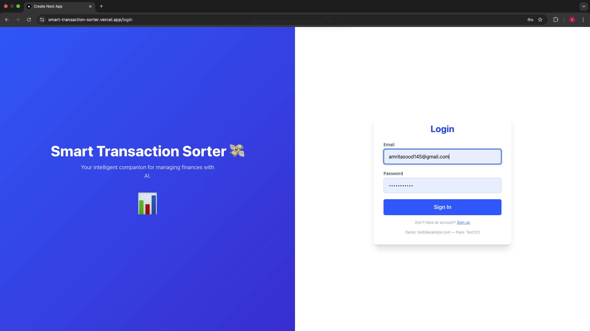
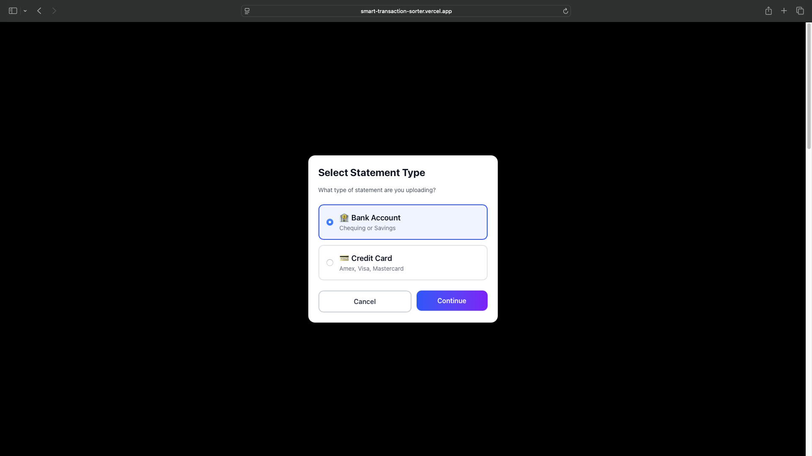
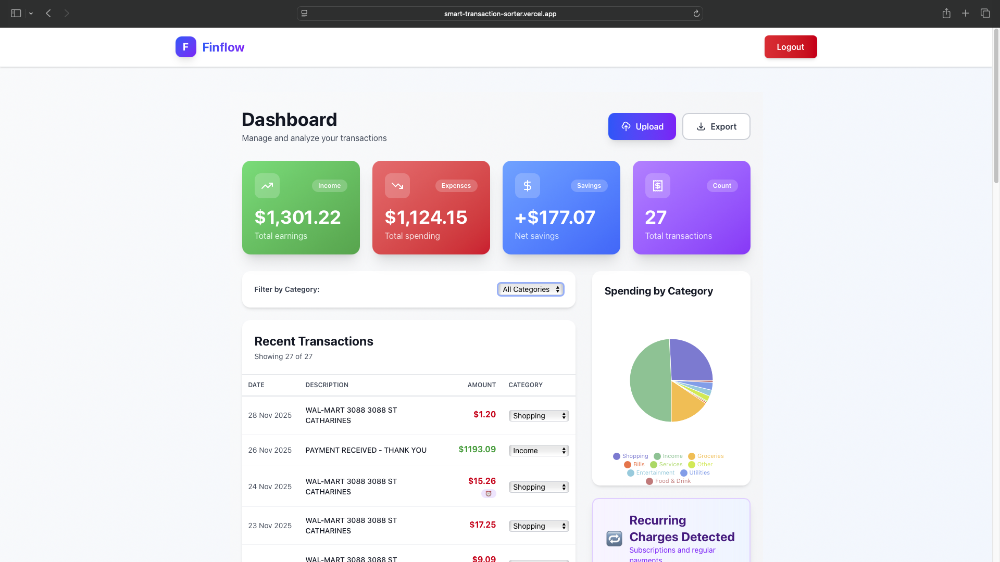
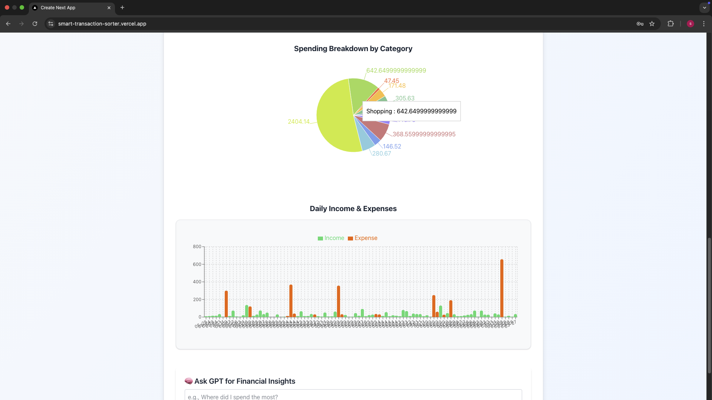
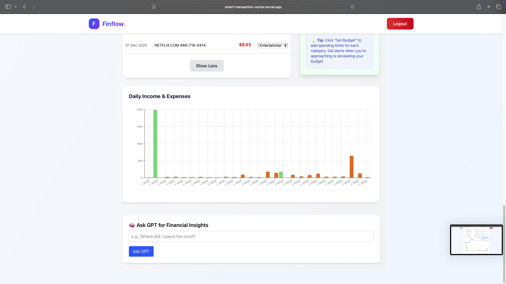

# FinFlow 💰

AI-powered web application that analyzes bank transaction data, automatically categorizes expenses, and provides spending insights through an interactive dashboard.

## 🚀 Live Demo

**[View Live Application](https://smart-transaction-sorter.vercel.app)**

## ✨ Features

- 🔐 Secure user authentication with JWT
- 📊 CSV or Excel file upload and processing with intelligent header detection
- 🤖 AI-powered transaction categorization using OpenAI GPT-4
- ⚠️ Anomaly detection for unusual spending patterns
- 📈 Interactive analytics dashboard with visualizations
- 💡 AI insights assistant for personalized spending recommendations
- 📥 Export analyzed data to CSV
- 🔄 Manual category editing and transaction management
- 📱 Responsive design for mobile and desktop

## 🛠️ Tech Stack

- **Frontend:** Next.js 14, React, TypeScript, Tailwind CSS, Recharts
- **Backend:** Next.js API Routes, Node.js
- **Database:** MongoDB with Mongoose ODM
- **AI:** OpenAI GPT-4 API
- **Authentication:** JWT with bcrypt password hashing
- **Deployment:** Vercel
- **File Processing:** CSV parsing with intelligent column mapping

## 📸 Screenshots

### Login Page


### CSV Upload & Processing


### Transactions Dashboard


### Analytics & Visualizations


### AI Insights Assistant


## 🎯 Key Highlights

- **Intelligent CSV Processing:** Automatically detects and maps various CSV formats from different banks
- **Real-time AI Categorization:** Uses GPT-4 to intelligently categorize transactions into 12+ categories
- **Visual Analytics:** 
  - Spending breakdown by category with pie charts
  - Daily income/expense tracking with bar charts
  - Time-series spending trends
- **Anomaly Detection:** Identifies unusual spending patterns based on historical data
- **Natural Language Insights:** AI-powered assistant provides personalized financial advice
- **Transaction Management:** Edit categories, add notes, and manage transactions manually
- **Export Functionality:** Download processed transactions with categories

## ⚙️ Setup Instructions

1. **Clone the repository**
```bash
git clone https://github.com/Samarr1981/smart-transaction-sorter.git
cd smart-transaction-sorter
```

2. **Install dependencies**
```bash
npm install
```

3. **Set up environment variables**

Create a `.env.local` file in the root directory:
```bash
MONGODB_URI=your_mongodb_connection_string
JWT_SECRET=your_jwt_secret_key
OPENAI_API_KEY=your_openai_api_key
```

4. **Run the development server**
```bash
npm run dev
```

5. **Open your browser**

Navigate to [http://localhost:3000](http://localhost:3000)

## 📊 Transaction Categories

FinFlow categorizes transactions into the following categories:

- 🍔 Food & Dining
- 🛒 Groceries
- 🚗 Transportation
- 🏠 Housing & Utilities
- 🎬 Entertainment
- 🏥 Healthcare
- 👕 Shopping
- ✈️ Travel
- 📚 Education
- 💼 Business
- 💰 Income
- 📝 Other

## 🔒 Security Features

- Password hashing with bcrypt
- JWT-based authentication
- Protected API routes
- Secure session management
- Environment variable protection

## 🔮 Future Enhancements

- Enhanced recurring transaction detection and management
- Multi-currency support with real-time exchange rates
- Budget tracking and customizable alerts
- Savings goals and recommendations
- Mobile app version (React Native)
- Bank API integration for automatic transaction syncing
- Advanced data visualization options
- PDF report generation
- Multi-user household accounts

## 📝 Known Limitations

- AI categorization accuracy depends on transaction description quality
- Anomaly detection threshold is continuously being refined
- Single currency support (CAD/USD)

## 🧪 Testing

**Demo Credentials:**
- Email: demo@finflow.com
- Password: demo123

**Sample CSV Format:**

Your CSV should contain columns for:
- Date (various formats supported)
- Description/Details
- Amount/Debit/Credit
- Balance (optional)

## 📄 License

This project is open source and available for educational purposes.

---

**Built with ❤️ as a capstone project demonstrating full-stack development with modern AI integration**

**Developer:** Samarpartap Passey  
**Project:** Computer Programming and Analysis Capstone  
**Institution:** Niagara College