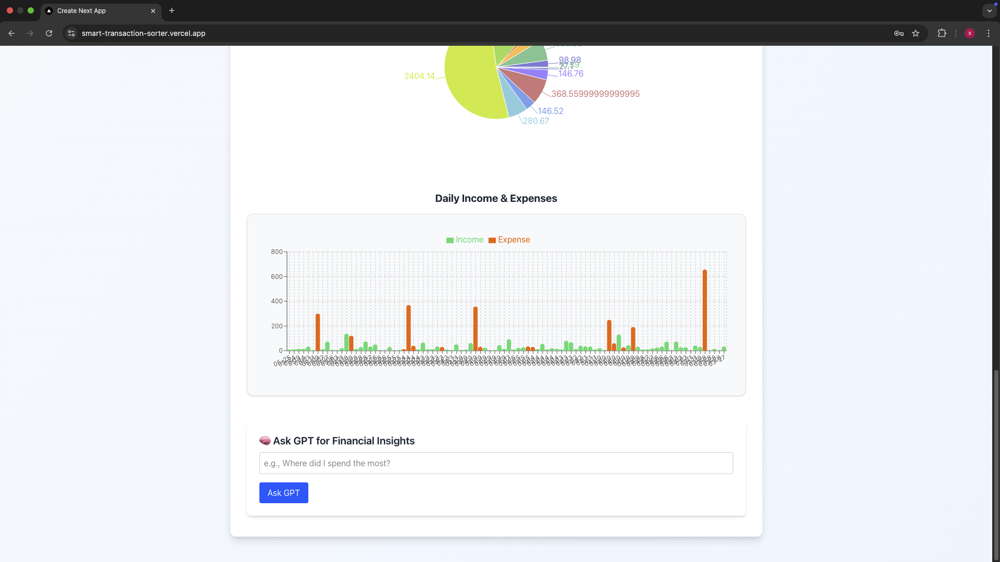

# Smart Transaction Sorter 💰

AI-powered web application that analyzes bank transaction data, automatically categorizes expenses, and provides spending insights through an interactive dashboard.

## 🚀 Live Demo

**[View Live Application](https://smart-transaction-sorter.vercel.app)**

## ✨ Features

- 🔐 Secure user authentication with JWT
- 📊 CSV file upload and processing
- 🤖 AI-powered transaction categorization using OpenAI GPT
- ⚠️ Anomaly detection for unusual spending patterns
- 📈 Interactive analytics dashboard with visualizations
- 💡 AI insights assistant for spending recommendations
- 📥 Export analyzed data

## 🛠️ Tech Stack

- **Frontend:** Next.js, React, TypeScript, Tailwind CSS
- **Backend:** Next.js API Routes, Node.js
- **Database:** MongoDB
- **AI:** OpenAI GPT-4 API
- **Authentication:** JWT
- **Deployment:** Vercel

## 📸 Screenshots

### Login Page


### CSV Upload & Processing


### Transactions Dashboard


### Analytics & Visualizations


### AI Insights Assistant


## 🎯 Key Highlights

- Processes CSV files with intelligent header detection
- Real-time AI categorization of transactions
- Visual spending breakdown by category
- Daily income/expense tracking with charts
- Anomaly detection for suspicious transactions
- Natural language insights powered by GPT

## ⚙️ Setup Instructions

1. Clone the repository
```bash
git clone https://github.com/Samarr1981/smart-transaction-sorter.git
cd smart-transaction-sorter
```

2. Install dependencies
```bash
npm install
```

3. Set up environment variables
```bash
MONGODB_URI=your_mongodb_connection_string
JWT_SECRET=your_jwt_secret
OPENAI_API_KEY=your_openai_api_key
```

4. Run the development server
```bash
npm run dev
```

5. Open [http://localhost:3000](http://localhost:3000)

## 🔮 Future Enhancements

- Excel file support (.xlsx)
- Enhanced recurring transaction detection
- Multi-currency support
- Budget tracking and alerts
- Mobile app version

## 📝 Known Limitations

- AI categorization accuracy varies based on transaction description clarity
- Anomaly detection threshold being refined based on user spending patterns

---

**Built with ❤️ as a capstone project demonstrating full-stack development with modern AI integration**

**Demo Credentials:**
- Email: test@example.com
- Password: Test123